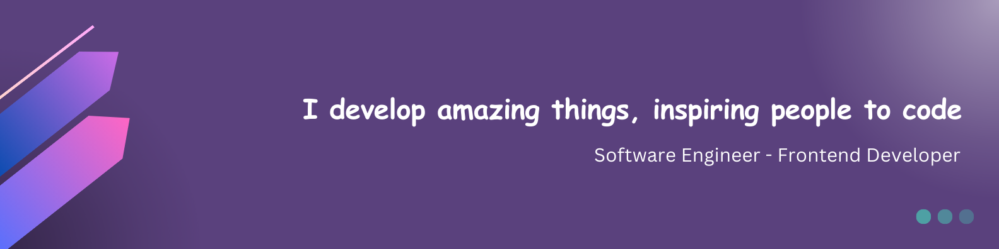

<!-- HEADER -->

&nbsp;

<h2 align="center">
TOOLS & TECHNOLOGIES
</h2>
  
<!--- language icons --->

<h2 align="center">
ABOUT ME
</h2>

Hello 👋, I'm Nazia, a software engineer at <a href="https://www.staunch.co" target="_blank">Staunch</a> passionate about innovative solutions that enhance user experience. I'm always curious to seeking opportunities to improve my skills and looking for chances to get better at what I do. 
So far I have the following tools in my toolkit:
 
 
• <b>Programming Languages:</b> JavaScript, TypeScript 
• <b>Front-End Development:</b> HTML, CSS, Bootstrap, React.js, Redux, Next.js, Tailwind,  
• <b>Back-End Development:</b> Node.js, Express.js, MongoDB, MySQL and GraphQL APIs 
• <b>Tools:</b> Postman, Figma, Adobe Xd, Canva Pro  

<b >
My Designing Portfolio: <a href="https://www.behance.net/_naziaa" target="_blank">https://www.behance.net/_naziaa</a>
</b>

	

&nbsp;

<h2 align="center">
CONNECT WITH ME
</h2>

	

